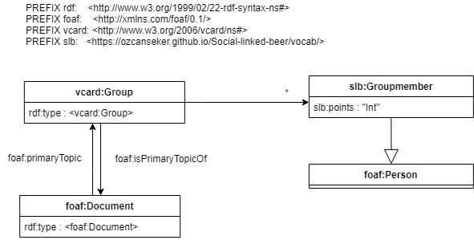
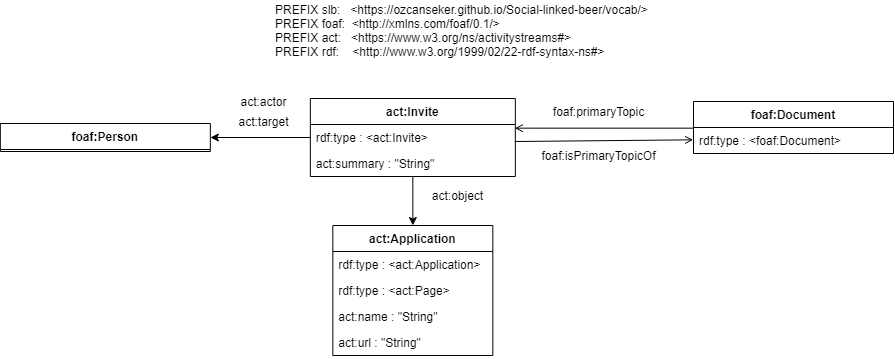
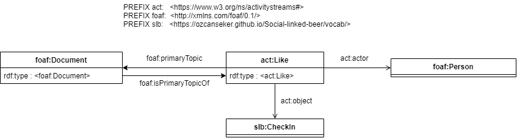

# Technical documentation

## 0 Index
- [1 Introduction](#1-introduction)
- [2 High level overview of the code structure](#2-high-level-overview-of-the-code-structure)
  - [2.1 Model](#21-model)
  - [2.2 Solid communicator](#22-solid-communicator)
  - [2.3 Beer data](#23-beer-data)
- [3 Folder structure + ACL](#3-folder-structure--acl)
  - [3.1 Detailed description folder structure](#31-detailed-description-folder-structure)
- [4 Ontologies](#4-ontologies)
  - [Meaning of symbols](#41-meaning-of-symbols)
  - [Ontologies of different files](#42-ontologies-of-different-files)
- [Quick start guide](#5-quick-start-guide-to-making-your-solid-app)
- [Code examples](#6-code-examples)
  

## 1 Introduction
This is the technical documentation for the Social Linked Beer application. This documentation describes how the 
application is build and what is used to build it. It also contains some tips and code examples on how to work with Solid.
For the source code and more detailed code documentation check the [src](../source/src) folder. For the funtional design check
[this file](FSD%20Solid%20Beer%20App%20v0.4.pdf). The functional design describes the application functionality and use cases.

## 2 High level overview of the code structure
This application uses the MVC design model to show data. 

- This design model makes the application stable. 
- It will make the application faster. Instead of loading all the application data at the start you can do async fetch 
requests.
- It will update the application when the fetch requests come back.

The model classes are plain javascript. The ui is made with React. The Solid communication is also plain javascript with
the help of [Solid auth client](https://github.com/solid/solid-auth-client) and [Solid file client](https://github.com/jeff-zucker/solid-file-client)
  
### 2.1 Model
I use my own observable class.  

Image: Observer class diagram  


You can subscribe to it and your update function will get called when the model updates.
The observable class will go trough the list of subscribes when the this.updateSubscribers function is called.
  
I have all my Model classes in a Holder class. This holder class subscribes to all sub model classes. 
The App react component subscribes to the Holder class.  

Image: ModelHolder class diagram  
  

### 2.2 Solid communicator
The Solid communicator handles all the messaging with the solid pod. The ui has elements(like buttons) that invoke
the methods of the Solid communicator. This will in turn do an action and update the model. The model then invokes the update method of 
the ui and the ui gets updated.  
  
Image: Sequence diagram request example  
  
  
**Building the Solid communicator**  
The Solid communicator gets build by the SolidCommunicatorBuilder. If this is the first time the user is using the application
the folder structure in the pod also needs to be build. The PodFolderBuilder is doing that part.  
  
### 2.3 Sparql endpoints. 
The application also uses a Sparql endpoint. The application uses the sparql endpoint to query the beer data. This beer data 
is information about the beers and brewers.
  
## 3 Folder structure + ACL  
The folder structure of the application in the solid pod is as follows:  
  
Image: folder structure application  
  
  
The ttl files have different ontologies. Check [the ontologies](#4-ontologies) section for more details on these ontologies.  

### 3.1 Detailed description folder structure
The next section will describe these folders more in detail.

### 3.1.1 social linked beer folder
ACL: Only Owner can view, write, append the contents

The social linked beer folder is the main folder. This folder can be seen in the public folder of the user's solid pod. 
This folder has the beerdrinker folder. If the application get expanded to also include the beerbrewer use cases, you could
use this folder to store the brewer folder. 

### 3.1.2 Beerdrinker folder 
ACL: Only Owner can view, write, append the contents.  
  
This is the folder where all the application data for the beerdrinker will be stored. This folder is divided in multiple folders.

### 3.1.3 appdata.ttl
ACL: Only Owner can view, write, append the contents. Friends can also see content.

This file shows the application data beerpoints and startdate. Friends can see this file. You can see the beerpoints
of friends, so you can compare it to each other. This file is the best place to share public account information. 

### 3.1.4 friends.ttl
ACL: Only Owner can view, write, append the contents.

This file has a VCARD group with friends. The application uses this group to handle access of Friends to different resources.
This file is only viewable by the Owner. 

### 3.1.5 checkIns folder
ACL: Only Owner can view, write, append the contents. Friends can view it.

The checkins folder is only write and appendable by the the Owner. This folder will hold the check ins for the user. Friends
can see the contents of this folder. This allows the application to show the check ins of friends. 

### 3.1.6 inbox
ACL: Only Owner can view, write, append the contents. Everyone can append.

It is an inbox so people can put stuff in it but not change it.

### 3.1.7 likes
ACL: Only Owner can view, write, append the contents.

The likes folder will be only viewable by the owner. The likes in it however are also viewable by the person who posted the checkin
that is liked. 

### 3.1.7 Groups
ACL: Only Owner can view,write,append the contents.

The groups folder is only visible to the owner. Individual group folders however are visible for everyone in that group.

## 4 Ontologies
In the next section I will describe the ontologies that I used to make the application. I tried to model it with uml. 

The ontologies will not really matter if a human has to go trough a graph to get the information. The human will 
eventually figure it out. The goals of these ontologies is to make it possible for programs to decipher the ontologies.
A program will be looking for well known vocabularies. Therefor it is smart to use well known vocabs and to sometimes
duplicate the same information in a different vocabulary.  
  
### 4.1 Meaning of symbols  
I used different kind of arrows and different kinds of ways to write things. In this section I wil explain what those 
symbols mean.  
  
**Prefix**  
I used the standard way of declaring prefixes to declare the prefixes in the ontologie diagram.

Image: Prefix notation  
  
  
**Class**  
The image below shows an example of a class. 

Image: Class notation  
  

As you might see I put the class type in two different places: Once as the title and once as a rdf:type. This seems redundant.
The logic behind it is, that rdf:type is an attribute while the title references the object itself. So the object itself will have
an uri(unless it as a blanknode) and the attribute rdf:type.
  
As you might also notice, I declare the literals and attributes that do not reference another object inside the box.  
  
Literals are depicted as "", with the type inside the quotations marks.  
  
Named nodes are depicted in between <>.  
  
**Association**  
Association is when a class knows/references another class. This will be done with an arrow. The arrow will always have a
attribute. This attribute will be near the arrow. 
  
Image: Association notation  
  
  
In the image below you will see an association between two classes. The foaf:Document references the slb:Checkin with the
foaf:primaryTopic and vice versa with the foaf:isPrimaryTopic.
  
Image: Association example  
  

if the reference to another object is only an uri the second class will have an empty body.

Image: reference to uri


Sometimes you need to specify the amount of object it can reference. This is done by putting a number or * near the arrow. 
\* means it can mean anything from 0 to infintite amount of references.  
  
Image: cardinality  
  
  
**Inheritance**  
Inheritance is when a class extends a different class. In the image below the slb:Checkin extends the sch:Action. Extending
allows me to make my own classes while still reusing the known vocabularies. I can add my own attributes to the class while still
using known vocabs. I might also use inheritance without adding attributes to make a class more specific.  
  
When a class extends another class it will inherit all attributes.  
  
Inheritance is modeled with an open white arrow.  
  
Image: Inheritance example    


### 4.2 Ontologies of different files
In this section I will describe the different ontologies used in the Social linked beer application. You will see a lot of foaf documents.
This is because the topic of these documents are not really the same as the document itself. The document just describes these objects.

#### 4.2.1 Appdata ontology
The AppData feels like a document. Therefore I made the BeerApplicationData extend foaf:Document. It has two attributes the 
points which describe the beer points the user has. The AppData also has a startDate.
  
Image: App data ontology  
  
  
#### 4.2.2 CheckIn ontology
A check in is a record of a beer that you drunk. So it is a record.  
  
I described the Check in as follows: 
  
Image: Check in ontology  
  
  
First we have a the document that describes the Check in. This Document has the type foaf:Document. This document is 
different than the Check in itself. The document has the check in as primary topic.

The check in has the type slb:CheckIn. This is a class I made up because the class it inherits from does not 
describing it completely. It inherits from act:Event. Also act:Event does not have the attribute checkinOf.

Technically the checkIn is an event. The event is there to give the check in the published attribute. I could have made
the Check in inherit from sch:CreativeWork but a Check in does not feel like a creative work. What might have been a Valid
alternative is if I added the act:published attribute to the slb:Checkin as a slb:published. I am trying to use as many
defined vocabs as possible and therefore I chose this method.  
  
The checkIn has three attributes: the rdf:type, the foaf:isPrimaryTopic and slb:checkInOf. The slb:checkInOf describes the ConsumeAction the user 
checked in. The ConsumeAction links the beer and the user that check in the beer.  

This file also contains the references to the likes given by other people. 

#### 4.2.3 Review ontology
A review is technically also a check in but with a review attached to it. 

I described the Review as follows: 
  
Image: Review ontology


The Review extends the checkIn. When you are reviewing a beer you are also checking it in. 

The slb:Review also extends the sch:Review. The sch:Review is defined by schema.org and has all the attributes I need.
  
#### 4.2.4 Friends ontology  
I used the vcard group to model the friends of the user. The vcard group gets used for access control.  
  
I also used the foaf:knows attribute. With this attribute other applications can easily find the friends in this application.  

Because I use the activity stream ontology everywhere else I decided to use it here as well. 

Image: Friends ontology  
   

#### 4.2.5 Groupdata ontology
The group data is just a vcard group to handle access control. The vcard group does not have a leader attibute. Therfore 
I had to extend it and make my own class.

   

#### 4.2.6 Group check-in index ontology  
The check in index is there to hold scores. You can not do this in the groupdata because they have different acl files.
This file should be mutate able by every group member. The groupdata file is only mutate able by the group leader.

   

#### 4.2.7 Solib invitation ontology
The invitation is based on [activity stream invite definition](https://www.w3.org/TR/activitystreams-vocabulary/#dfn-invite).

This is the invitation you can send to a user that is not yet using the Social Linked Beer app.

Image: Invite ontology.
  

#### 4.2.8 Friend request ontology
The friendship request is also based on the activity stream definition. See [here](https://www.w3.org/TR/activitystreams-vocabulary/#modeling-friend-requests) for an example.

  

#### 4.2.9 Group request ontology
This is a group request ontology. This describes how a user gets invited to a group. Based on the activity stream way of 
sending invitations.

  

#### 4.2.10 Like ontology
Like ontology is defined as followed: 

Image: Like ontology


There is nothing special about this. It just uses the 
[activity stream like definition](https://www.w3.org/TR/activitystreams-vocabulary/#dfn-like).
  
There is also a reference from the checkin to the like. This reference is saved in the checkin file.  
  
#### 4.2.11 Accept friend request ontology  
This is the ontology for when you accept a friend request. The FriendShipRequest is the original friendship request.  
  
Image: Accept friendship request ontology  
  

#### 4.2.12 Decline friend request ontologie
Same as accept friendshiprequest only different rdf:type.  
  
Image: Reject friendship request ontology  
  

#### 4.2.7 Other user group ontologie
This is the a link to the group from a non leader group member.

Image: A file that points to the group created by someone else
  

## 5 Quick start guide to making your Solid app  
This is a quick start guide to make your Solid app. If it is your first time working with Linked data and Solid, you might
do it wrong. You might not make the best ontlogies or your folder structure can become a mess. It is important to realize that you
will learn by making mistakes. Therefore I would not worry about it that much. You have to start somewhere.  
  
The thing I would worry about the least is the ontologies for the objects in your app. This is quite a bit of think work and you can 
change it later. However if you change it later you might have to change code in a lot of places. It is up to you to.

Below are a few thing to think about when creating you Solid app.  
1. You need to think out the app logic and use cases.
1. Think out the file structure of the application folder. what you want to place where and who can access it.
1. Make the ontologies you want to use. These might be temporary but it is still worth it to think it out before. Changing
it afterwards might be a lot less work if you put some thought into it before you start programming.
1. Make sure to separate the Solid communication from your front end. This will create less spaghetti code.
1. The rest will just be regular programming. The app logic needs to work.

## 6 Code examples
The code I use to make files. For folder I use the Solid file client.

Post solid file    
``` javascript
import solidAuth from 'solid-auth-client';

/**
 * Post a solid file.
 * @param folder The folder you want the file to live in
 * @param filename
 * @param body (ttl file)
 * @returns {Promise<void>}
 */
export async function postSolidFile(folder, filename, body) {
    authClient.fetch(folder, {
        method: 'POST',
        headers: {
            'Content-Type': 'text/turtle',
            'Link': '<http://www.w3.org/ns/ldp#Resource>; rel="type"',
            'SLUG': filename
        },
        body: body
    });
}
```

Put solid file (really handy when you need to set an ACL file) 
``` javascript
import solidAuth from 'solid-auth-client';

/**
 * Put the solid file. Will replace the current file.
 * @param url The url of the location of the resource.
 * @param body The body you want it to replace with (ttl file)
 * @returns {Promise<void>} ?
 */
export async function putSolidFile(url, body) {
    authClient.fetch(url, {
        method: 'PUT',
        headers: {
            'Content-Type': 'text/turtle'
        },
        body: body
    });
}
```

Append File    
``` javascript
import solidAuth from 'solid-auth-client';

/**
 * Allows you to append a solid file.
 * @param {*} url of the file you want to append
 * @param {*} body `INSERT DATA { <subject> <predicate> <object> }`
 */
export async function appendSolidResource(url, body) {
    authClient.fetch(url, {
        method: 'PATCH',
        headers: {
            'Content-Type': 'application/sparql-update'
        },
        body: body
    });
}
```